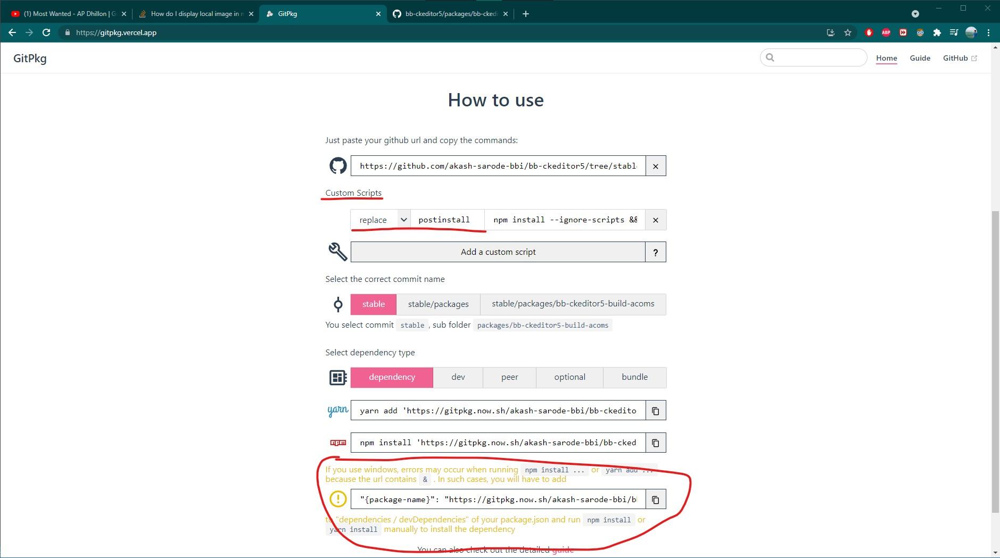
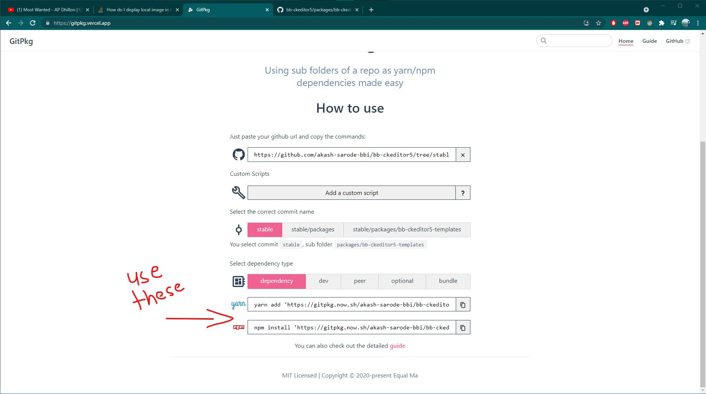

# Akash's system
  _NOTE - in case any of the problems you guys face are 
    system or environment specific,  refer following config_

  - Windows 10 / AMD
  - Node v14.15.5
  - npm 7.21.1
  - yarn 1.22.11

 

# Requirements 
  - node >=12.0.0
  - npm  >=5.7.1
  - yarn
  - git
  - gitpkg - https://gitpkg.vercel.app/ 

 

# Read
  - **package / dependency managers**
    - yarn - we will be using yarn, npm workspaces are BUGGY 
    - npm (optional) - testing / installing build in any other project you can use npm
      as npm is mostly used in projects
    - npm vs yarn - both are basically same with differeces like (npm install / yarn add)

  - **yarn / npm workspaces** - I liked npm docs better, refer those if you want to 
  
    **BUT, WE'LL BE USING YARN WORKSPACES ONLY**
  

  - **Monolithic Repositories** - Our bb-ckeditor5 repository uses a monolithic structure
    in essence, monolithic repositories are independent projects / packages developed 
    under single git repository which otherwise would be hosted on multiple git repos.
    THAT IS WHY, WE NEED YARN WORKSPACES, TO WORK WITH MONOREPOS.

  - **npm link (OPTIONAL)** - prior to workspaces, npm / yarn used links to link packages
    so that they can be tested locally without continuously rebuilding them, 
    with workspaces we do not have to worry about them, but it'll be a plus to know 
    what npm link is and how it is simplified with workspaces, read more here - https://docs.npmjs.com/cli/v7/commands/npm-link

  - **gitpkg** - to use our git subfolders(./packages/**) as packages in  other projects eg acoms
    as npm is again BUGGY with this. go through its docs, not a lot to read!
    WE'LL NEED TO ADD CUSTOM SCRIPT FROM GITPKG FOR POSTINSTALL

 

# Setting up development environment
  - git clone bb-ckeditor5 git repository
  - yarn install 

     

# Naming packages (Builds / Plugins)
  - when copying existing package.json for builds or creating new one for a plugin
  - following this naming scheme - @ckeditor/bb-ckeditor5-( build/plugin-name )-( build-name/* )
  - @ckeditor is the scope and makes it easier to find the package in the node_modules
  - I have used `bb` before `ckeditor5` to specify packages that we have developed
  - depending on the type of the package include `build` in the package name or just the plugin name  

    
 
# creating a new build
  - copy contents of any existing build you'd like to extend eg ./packages/ckeditor5-build-classic
  - make changes to package.json according to the new buid eg name, description etc, rest can stay the same
  - check webpack.config.js output.library for exporting with a custom name

  - import additional official ckeditor plugins or cutom ones
  - make sure to add additional plugins to dependency list (yarn add ...)
  - more about adding custom plugins to build in II. creating a custom plugin section
  
  - once tested locally, push build to git
  - then copy link to subfolder of the build and go to https://gitpkg.vercel.app/ 
  - do not forget to add custom script as shown in screenshot custom script - replace - postinstall - npm install -ignore-scripts && npm run build
  - 
  - this build can now be installed in any node project
  - _NOTE - when using postinstall script gitpkg yarn and npm commands wont work, as shown in screenshot, copy package name from its package.json, add the dependency manually in your project and then run npm install_

 

# creating a new plugin
  - cd packages
  - mkdir plugin name
  - yarn init -y
  - edit package json 
    - set name as @ckeditor/bb-ckeditor5-*
    - main: src/pluginName.js

  - mkdir src
  - inside src, create 3 files, pluginName.js, pluginNameEditing.js, pluginNameUI.js

  - import into a build and test

  - if using a custom one we have newly built, test it locally, no need to add it to dependency yet
    just make sure that you have run yarn istall after creating the new plugin so it gets added and linked 
    in the workspace(added to node_modules)

    then you can use the plugin without adding as a dependency in a build

    after testing the plugin locally, push it to git and use gitpkg like shown in below screenshot

    

    now that plugin can be added as dependency with the gitpkg link

 

